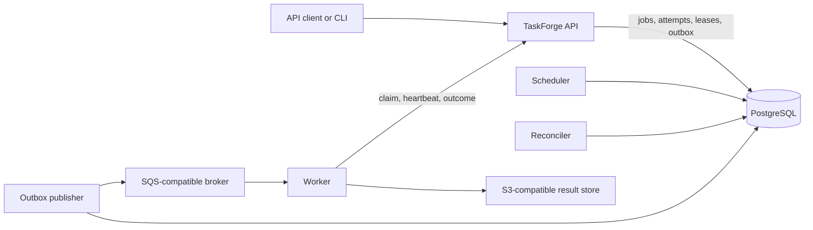

# TaskForge

[](https://github.com/co-rtex/TaskForge/actions/workflows/ci.yml?query=branch%3Amain)
[](LICENSE)

**A durable distributed job-processing platform in Go with PostgreSQL-authoritative state, at-least-once execution, transactional outbox delivery, fenced leases, retries, DLQ replay, and crash recovery.**

> **Status:** early development, milestone 5E of 8. The durable job lifecycle, authenticated worker control, result storage, and CLI are implemented. The Python SDK and dashboard are not. See [Current State](docs/CURRENT_STATE.md) for the exact verified boundary.

## Why It Exists

A queue can move a message, but it does not by itself make job execution durable or correct. TaskForge focuses on the control-plane problems behind a reliable job platform: duplicate submissions, lost notifications, worker crashes, stale attempts, cancellation races, bounded retries, delayed work, and durable result delivery.

TaskForge implements those mechanisms directly instead of wrapping an existing job framework, making the invariants and failure handling visible in the codebase.

## Key Features

- Durable immediate and delayed job submission with idempotency keys
- Transactional outbox from PostgreSQL to an SQS-compatible broker
- Atomic priority- and capability-aware claims with queue and worker capacity limits
- Renewable leases, attempt fencing, heartbeats, and stale-session recovery
- Retry with bounded exponential backoff, server-authoritative timeouts, and cancellation
- Logical DLQ with listing, replay, and operator retry
- Scoped, revocable API and worker credentials
- Inline PostgreSQL results plus S3-compatible storage for larger results
- CLI with stable, individually tested exit codes

## Architecture



PostgreSQL owns all authoritative control-plane state. The broker carries only advisory work-availability notifications. Workers pull from the control plane, and every claim or outcome is accepted only while its attempt, lease, session, scope, and state are still valid.

This design keeps correctness independent of queue ordering, exactly-once delivery, process memory, and a worker's wall clock. See [Architecture](docs/ARCHITECTURE.md) and the [ADRs](docs/adr/README.md) for the invariants and tradeoffs.

## Execution Guarantee

TaskForge targets **durable at-least-once execution** with idempotent control-plane transitions and fenced stale attempts. It does not claim exactly-once execution.

A handler may run more than once, so handlers with external side effects must be idempotent. If an expired or canceled attempt later reports success, fencing prevents that stale outcome from committing. See [ADR-0002](docs/adr/0002-at-least-once-execution-semantics.md).

## Technical Highlights

| Area | Implementation |
| --- | --- |
| Concurrency | SQL-backed atomic claims, explicit locking, queue limits, and worker capacity |
| Reliability | Leases, heartbeats, retries, recovery, cancellation, timeouts, and DLQ replay |
| Consistency | PostgreSQL-authoritative state and transactional outbox delivery |
| Idempotency | Submission fingerprints, notification identity, renewal fences, and retained outcome identity |
| Security | Scoped and revocable API/worker keys; loopback-only credential management |
| Storage | Inline results with S3-compatible overflow storage |
| Contracts | OpenAPI specification, typed state transitions, and stable CLI exit codes |
| Verification | Unit, integration, OpenAPI contract, crash-recovery, contention, and race tests |

## Tech Stack

- **Services:** Go 1.25
- **Database:** PostgreSQL 16 with explicit SQL and `pgx/v5`
- **Broker:** SQS-compatible; ElasticMQ for local development
- **Object storage:** S3-compatible; LocalStack for local development
- **Interfaces:** HTTP/OpenAPI and `taskforge-cli`
- **Local environment:** Docker Compose and GNU Make
- **CI:** GitHub Actions with real PostgreSQL, broker, and object-store dependencies

## Getting Started

Requirements: Git, Go 1.25+, Docker, Docker Compose, and GNU Make.

```bash
make bootstrap
make up
make migrate
make build
```

Start the API, outbox publisher, scheduler, worker, and reconciler in separate terminals:

```bash
./bin/taskforge-api
./bin/taskforge-outbox
./bin/taskforge-scheduler
./bin/taskforge-worker
./bin/taskforge-reconciler
```

Before starting the worker, create an API key and worker key for the same local scope. These credential-management routes intentionally bind to loopback and must not be exposed publicly.

```bash
curl -X POST http://127.0.0.1:8080/internal/v1/api-keys \
  -H 'Content-Type: application/json' \
  -d '{"scope":"local-dev","name":"my-laptop"}'

curl -X POST http://127.0.0.1:8080/internal/v1/worker-keys \
  -H 'Content-Type: application/json' \
  -d '{"scope":"local-dev","name":"my-worker"}'
```

Export the returned credentials as `TASKFORGE_API_KEY` and `TASKFORGE_WORKER_API_KEY`, then start the worker. Each key is returned exactly once.

## Example

Submit an idempotent `demo.echo` job:

```bash
curl -X POST http://127.0.0.1:8080/v1/jobs \
  -H "Authorization: Bearer $TASKFORGE_API_KEY" \
  -H 'Content-Type: application/json' \
  -H 'Idempotency-Key: my-first-job' \
  -d '{"queue":"default","job_type":"demo.echo","payload":{"message":"hello"}}'
```

Submitting the same idempotency key and body returns the original job. Reusing the key with a different body returns `409`. Once the worker succeeds, retrieve the result through `GET /v1/jobs/{job_id}/result`.

To observe recovery, terminate a worker during execution. After its session and lease become stale, the reconciler abandons the old attempt and makes the job eligible for another worker. A late outcome from the stale attempt is rejected by the fence.

## Testing

```bash
make test
make test-race
```

The integration suite runs against real PostgreSQL, ElasticMQ, and S3-compatible storage. CI also verifies formatting, linting, builds, migrations, OpenAPI contracts, concurrency behavior, worker-process crash recovery, and the race detector.

## Project Status

| Implemented | Planned |
| --- | --- |
| Durable submission and delayed jobs | Python SDK |
| Worker sessions, claims, leases, and heartbeats | Operator dashboard |
| Retries, cancellation, timeouts, DLQ, and replay | Metrics and distributed tracing |
| API and worker authentication | Additional production handlers |
| Inline and object-backed result storage | Deployment hardening |
| Operator/developer CLI |  |

For the commit-by-commit implementation boundary, read [Current State](docs/CURRENT_STATE.md). Planned work is tracked in the [Roadmap](docs/ROADMAP.md).

## Documentation

| Document | Purpose |
| --- | --- |
| [Project Specification](docs/PROJECT_SPEC.md) | V1 scope, guarantees, and non-goals |
| [Architecture](docs/ARCHITECTURE.md) | Components, state machines, invariants, and failure model |
| [Current State](docs/CURRENT_STATE.md) | What is implemented and verified at this commit |
| [Roadmap](docs/ROADMAP.md) | Milestone sequence |
| [Architecture Decisions](docs/adr/README.md) | Design rationale and tradeoffs |
| [OpenAPI](api/openapi.yaml) | Implemented HTTP contract |

## Performance

No performance results are published yet. Targets in the project specification remain explicitly unmeasured until a reproducible benchmark run produces recorded evidence.

## License

[Apache-2.0](LICENSE)
